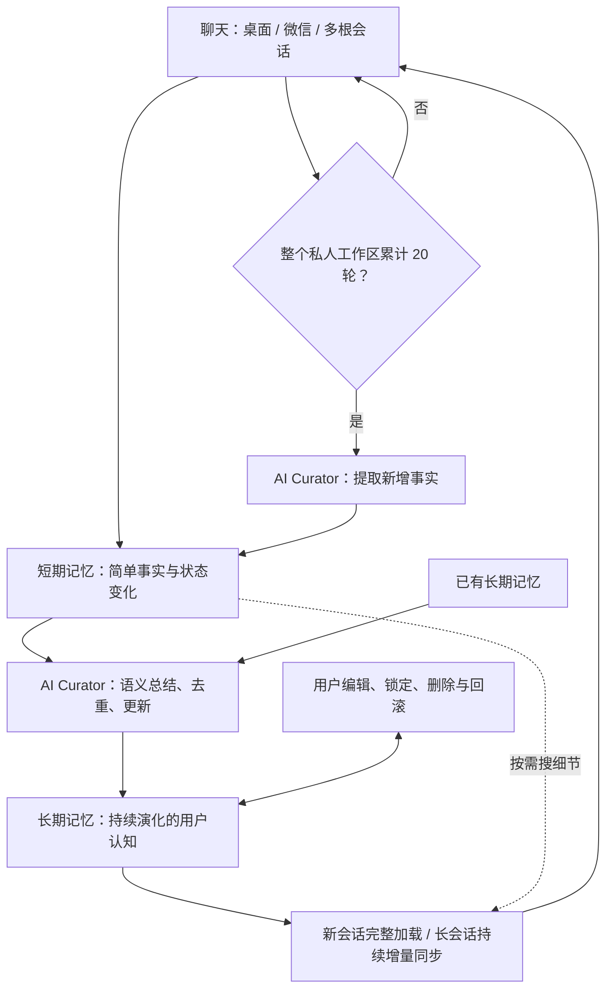

# Feiyu Memory 1.3.0 · 可复用流程图

```mermaid
flowchart TD
    A["聊天：桌面 / 微信 / 多根会话"] --> B["短期记忆：简单事实与状态变化"]
    A --> C{"整个私人工作区累计 20 轮？"}
    C -->|是| D["AI Curator：提取新增事实"]
    C -->|否| A
    D --> B
    B --> E["AI Curator：语义总结、去重、更新"]
    F["已有长期记忆"] --> E
    E --> G["长期记忆：持续演化的用户认知"]
    G --> H["新会话完整加载 / 长会话持续增量同步"]
    B -. "按需搜细节" .-> H
    I["用户编辑、锁定、删除与回滚"] <--> G
    H --> A
```

这张图使用 GitHub 原生 Mermaid 渲染，改动流程时不需要额外制图软件。
